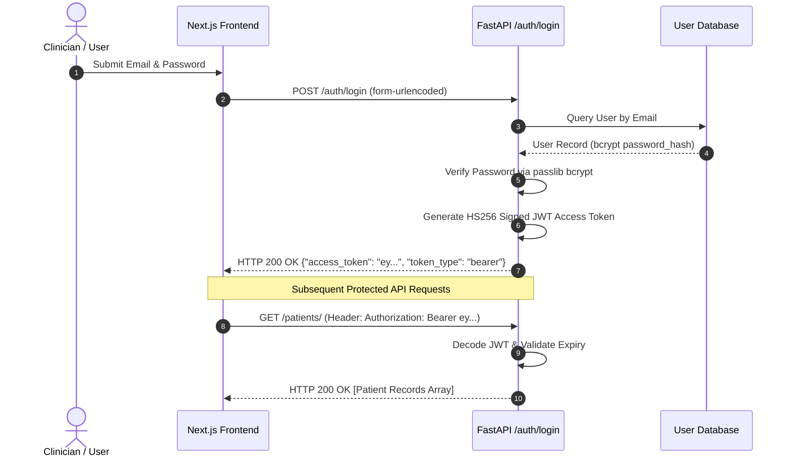

# 11 — Authentication Architecture

> **Path:** `architecture-project/11-authentication-architecture.md`  
> **Status:** Implemented & Verified (OAuth2 Password Bearer + Bcrypt + JWT)  

```mermaid
sequenceDiagram
    autonumber
    actor Clinician as Clinician / User
    participant Frontend as Next.js Frontend
    participant AuthAPI as FastAPI /auth/login
    participant DB as User Database

    Clinician->>Frontend: Submit Email & Password
    Frontend->>AuthAPI: POST /auth/login (form-urlencoded)
    AuthAPI->>DB: Query User by Email
    DB-->>AuthAPI: User Record (bcrypt password_hash)
    AuthAPI->>AuthAPI: Verify Password via passlib bcrypt
    AuthAPI->>AuthAPI: Generate HS256 Signed JWT Access Token
    AuthAPI-->>Frontend: HTTP 200 OK {"access_token": "ey...", "token_type": "bearer"}
    
    Note over Frontend,AuthAPI: Subsequent Protected API Requests
    Frontend->>AuthAPI: GET /patients/ (Header: Authorization: Bearer ey...)
    AuthAPI->>AuthAPI: Decode JWT & Validate Expiry
    AuthAPI-->>Frontend: HTTP 200 OK [Patient Records Array]
```
