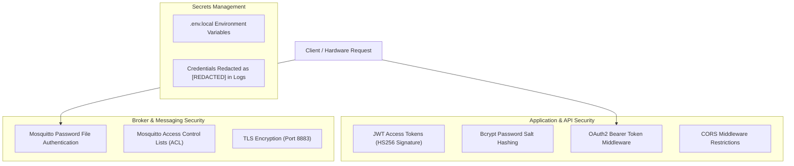

# 12 — Security Architecture

> **Path:** `architecture-project/12-security-architecture.md`  
> **Status:** Implemented Security Controls  

```mermaid
flowchart TD
    subgraph Auth_Security["Application & API Security"]
        JWT["JWT Access Tokens (HS256 Signature)"]
        Bcrypt["Bcrypt Password Salt Hashing"]
        OAuth2["OAuth2 Bearer Token Middleware"]
        CORS["CORS Middleware Restrictions"]
    end

    subgraph MQTT_Security["Broker & Messaging Security"]
        MQTTPass["Mosquitto Password File Authentication"]
        MQTTACL["Mosquitto Access Control Lists (ACL)"]
        TLS["TLS Encryption (Port 8883)"]
    end

    subgraph Secrets_Security["Secrets Management"]
        EnvFile[".env.local Environment Variables"]
        Redacted["Credentials Redacted as [REDACTED] in Logs"]
    end

    Client["Client / Hardware Request"] --> OAuth2 & MQTTPass
```
