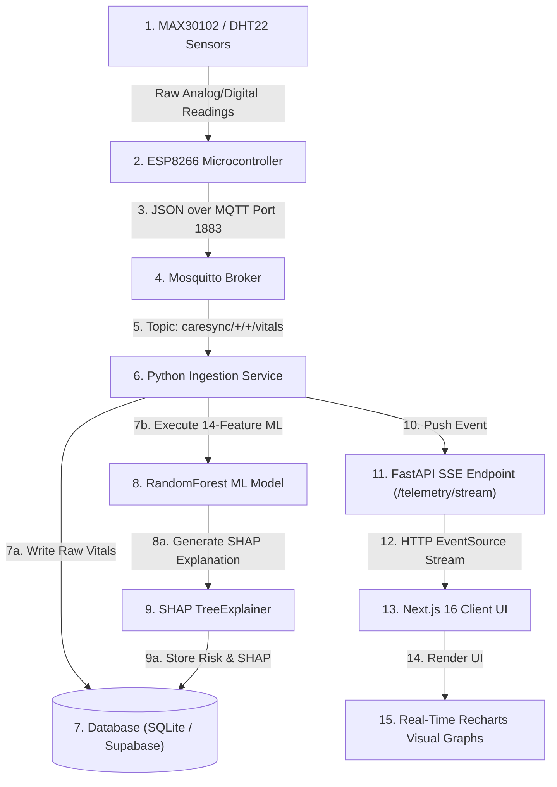

# 13 — Complete System Data-Flow Architecture

> **Path:** `architecture-project/13-data-flow-architecture.md`  
> **Status:** Full End-to-End System Workflow  

```mermaid
flowchart TD
    Sensors["1. MAX30102 / DHT22 Sensors"] -->|Raw Analog/Digital Readings| ESP["2. ESP8266 Microcontroller"]
    ESP -->|3. JSON over MQTT Port 1883| Mosquitto["4. Mosquitto Broker"]
    Mosquitto -->|5. Topic: caresync/+/+/vitals| Ingest["6. Python Ingestion Service"]
    
    Ingest -->|7a. Write Raw Vitals| DB[("7. Database (SQLite / Supabase)")]
    Ingest -->|7b. Execute 14-Feature ML| ML["8. RandomForest ML Model"]
    ML -->|8a. Generate SHAP Explanation| SHAP["9. SHAP TreeExplainer"]
    SHAP -->|9a. Store Risk & SHAP| DB
    
    Ingest -->|10. Push Event| SSE["11. FastAPI SSE Endpoint (/telemetry/stream)"]
    SSE -->|12. HTTP EventSource Stream| NextJS["13. Next.js 16 Client UI"]
    NextJS -->|14. Render UI| Recharts["15. Real-Time Recharts Visual Graphs"]
```
