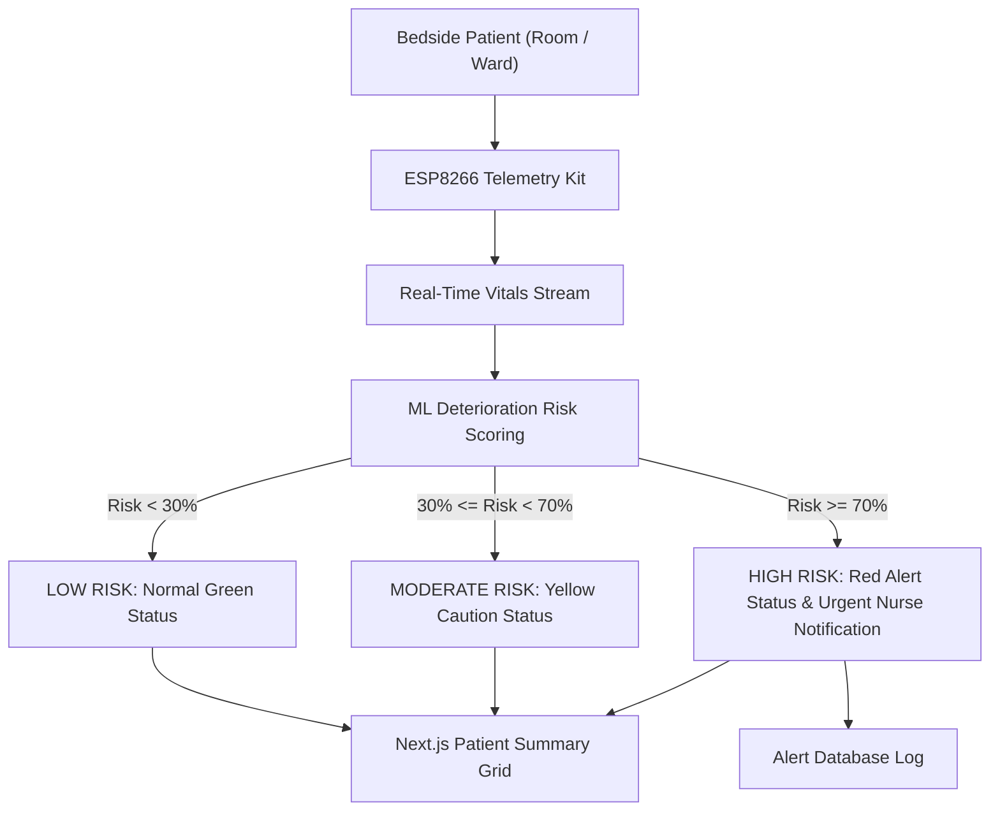

# 14 — Patient Monitoring Workflow Architecture

> **Path:** `architecture-project/14-patient-monitoring-flow.md`  
> **Status:** Implemented Clinical Workflow  

```mermaid
flowchart TD
    Patient["Bedside Patient (Room / Ward)"] --> Device["ESP8266 Telemetry Kit"]
    Device --> Telemetry["Real-Time Vitals Stream"]
    Telemetry --> ML_Assessment["ML Deterioration Risk Scoring"]
    
    ML_Assessment -->|Risk < 30%| LowRisk["LOW RISK: Normal Green Status"]
    ML_Assessment -->|30% <= Risk < 70%| ModRisk["MODERATE RISK: Yellow Caution Status"]
    ML_Assessment -->|Risk >= 70%| HighRisk["HIGH RISK: Red Alert Status & Urgent Nurse Notification"]

    LowRisk & ModRisk & HighRisk --> Dashboard["Next.js Patient Summary Grid"]
    HighRisk --> AlertLog["Alert Database Log"]
```
