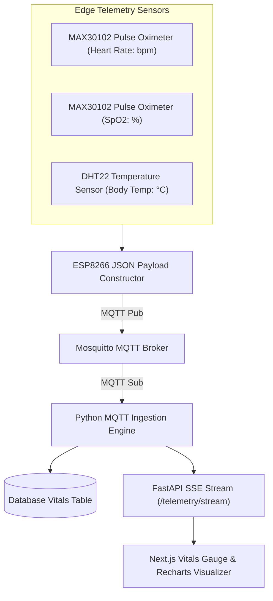

# 16 — Vital-Signs Data-Flow Architecture

> **Path:** `architecture-project/16-vitals-data-flow.md`  
> **Status:** Implemented Telemetry Pipeline  

```mermaid
flowchart TD
    subgraph Edge_Sensors["Edge Telemetry Sensors"]
        MAX_HR["MAX30102 Pulse Oximeter (Heart Rate: bpm)"]
        MAX_SpO2["MAX30102 Pulse Oximeter (SpO2: %)"]
        DHT_Temp["DHT22 Temperature Sensor (Body Temp: °C)"]
    end

    Edge_Sensors --> ESP["ESP8266 JSON Payload Constructor"]
    ESP -->|MQTT Pub| Mosquitto["Mosquitto MQTT Broker"]
    Mosquitto -->|MQTT Sub| Ingestion["Python MQTT Ingestion Engine"]
    Ingestion --> DB[("Database Vitals Table")]
    Ingestion --> SSE["FastAPI SSE Stream (/telemetry/stream)"]
    SSE --> UI["Next.js Vitals Gauge & Recharts Visualizer"]
```
