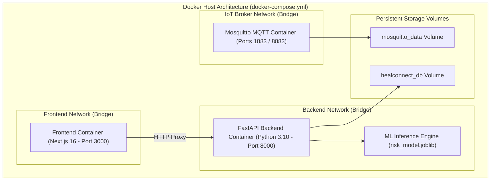

# 17 — Deployment Architecture

> **Path:** `architecture-project/17-deployment-architecture.md`  
> **Status:** Implemented & Verified Containerized Environment  

```mermaid
flowchart TD
    subgraph Docker_Host["Docker Host Architecture (docker-compose.yml)"]
        subgraph Net_Frontend["Frontend Network (Bridge)"]
            NextContainer["Frontend Container (Next.js 16 - Port 3000)"]
        end

        subgraph Net_Backend["Backend Network (Bridge)"]
            APIContainer["FastAPI Backend Container (Python 3.10 - Port 8000)"]
            MLService["ML Inference Engine (risk_model.joblib)"]
        end

        subgraph Net_IoT["IoT Broker Network (Bridge)"]
            MosquittoContainer["Mosquitto MQTT Container (Ports 1883 / 8883)"]
        end

        subgraph Storage_Volumes["Persistent Storage Volumes"]
            MosquittoVol["mosquitto_data Volume"]
            DBVol["healconnect_db Volume"]
        end
    end

    NextContainer -->|HTTP Proxy| APIContainer
    APIContainer --> MLService
    APIContainer --> DBVol
    MosquittoContainer --> MosquittoVol
```
