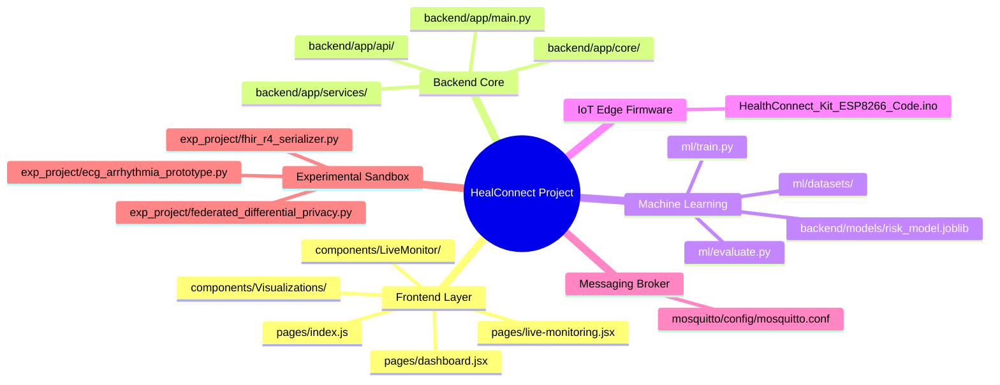

# 18 — Complete Project Module Map

> **Path:** `architecture-project/18-project-module-map.md`  
> **Status:** Verified Source File Mapping  

```mermaid
mindmap
  root((HealConnect Project))
    Frontend Layer
      pages/index.js
      pages/dashboard.jsx
      pages/live-monitoring.jsx
      components/LiveMonitor/
      components/Visualizations/
    Backend Core
      backend/app/main.py
      backend/app/api/
      backend/app/core/
      backend/app/services/
    Machine Learning
      ml/train.py
      ml/evaluate.py
      ml/datasets/
      backend/models/risk_model.joblib
    IoT Edge Firmware
      HealthConnect_Kit_ESP8266_Code.ino
    Messaging Broker
      mosquitto/config/mosquitto.conf
    Experimental Sandbox
      exp_project/ecg_arrhythmia_prototype.py
      exp_project/fhir_r4_serializer.py
      exp_project/federated_differential_privacy.py
```
