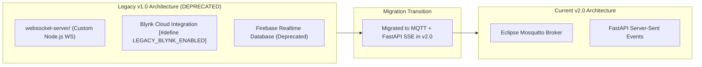

# 19 — Legacy Architecture & Deprecated Components

> **Path:** `architecture-project/19-legacy-architecture.md`  
> **Status:** LEGACY / Fallback Components Classified  

```mermaid
flowchart LR
    subgraph Legacy_v1["Legacy v1.0 Architecture (DEPRECATED)"]
        WebSocket_Server["websocket-server/ (Custom Node.js WS)"]
        Blynk["Blynk Cloud Integration [#define LEGACY_BLYNK_ENABLED]"]
        Firebase["Firebase Realtime Database (Deprecated)"]
    end

    subgraph Migration["Migration Transition"]
        Migrate["Migrated to MQTT + FastAPI SSE in v2.0"]
    end

    subgraph Current_v2["Current v2.0 Architecture"]
        Mosquitto["Eclipse Mosquitto Broker"]
        SSE["FastAPI Server-Sent Events"]
    end

    Legacy_v1 --> Migrate --> Current_v2
```
